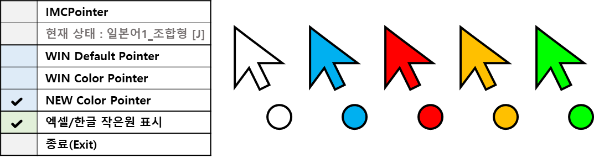

<div align="center">

# 🌍 IMCPointer

### I'm a Color Pointer that helps to identify the keyboard input language.
(English Lower, English Upper, Korean, Pali, Japanese)

### 입력 모드에 따라 색상이 바뀌는 마우스 포인터 유틸리티


</div>

<br>

## 💡 개발 동기 (Why IMCPointer?)

#### 🎯 마우스 포인터로 입력 상태를 한눈에 파악

> "문자 입력 상태에 따라 마우스 포인터의 색상이 변한다면, 컴퓨터 문서 작업에 도움이 될텐데?"

- **문제**: 한글, 영어, 일본어, Pali어 등의 모드를 번갈아 사용할 때 현재 입력모드를 놓치기 쉬움

- **해결**: 마우스 포인터와 트레이 아이콘의 색상으로 **입력 상태를 즉각적 시각화**

- **효과**: 타이핑 오류 감소, 작업 효율 증대


<br>

## ✨ 주요 기능 (Key Features)

### 1️⃣ 입력 상태별 5가지 색상 테마 제공

- 입력 모드가 변경되면 마우스 포인터와 트레이 아이콘의 색깔이 **즉각적으로** 변합니다.

<div align="center">

| 입력 상태 | 포인터 색상 | 트레이 문자 | 설명 |
|:---|:---|:---:|:---|
| **영어 소문자** | $\color{white}\Large\blacktriangle$ White | $\color{gray}\large\boldsymbol{e}$ | 영어 소문자 입력 (CAPS Off) |
| **영어 대문자** | $\color{DeepSkyBlue}\Large\blacktriangle$ DeepSkyBlue | $\color{deepskyblue}\large\textbf{E}$ | 영어 대문자 입력 (CAPS On) |
| **한글** (기본) | $\color{red}\Large\blacktriangle$ Red | $\color{red}\large\textbf{K}$ | 한글 입력 (Caps Off) |
| **Pali Unicode** | $\color{orange}\Large\blacktriangle$ Orange | $\color{orange}\large\textbf{p}$ | Us + Pali unicode 설치시 || **일본어1** (조합형) | $\color{lime}\Large\blacktriangle$ Lime | $\color{lime}\large\textbf{J}$ | **한글CAPS** + 자음/모음 조합 |
| **Japanese IME** | $\color{lime}\Large\blacktriangle$ Lime | $\color{lime}\large\textbf{j}$ | 일본어 IME 설치시 |

</div>

### 2️⃣ 아래한글(hwp)과 엑셀(excel)에서 포인터 하단에 작은원(mini indicator) 표시

- 마우스 포인터를 자체적으로 관리하는 앱(한글,엑셀)에서는 포인터 우측 하단에 **'작은원'**을 생성하고 입력 상태에 따라 색상을 변경합니다.

  ⚠️ Microsoft Excel (`excel.exe`)의 셀 위에서는 포인터가 흰색 십자가 형태로 바뀐다.
  
  ⚠️ 한글과컴퓨터 아래한글 (`hwp.exe`)의 텍스트 입력창 안에서는 포인터가 검은색 I자로 바뀐다.

### 3️⃣ 트레이 아이콘 **클릭**하여 메뉴 선택하고, 옵션 On/Off

<div align="center">



</div>

<br>

## 💡 사용팁 (Tips)

### 4️⃣ 아래한글에서 윈도우 MS IME 사용하기

> 📌 [TIP]
> 한글과컴퓨터의 자체 입력기 대신 Microsoft IME를 사용하도록 전환하면, 아래한글에서도 IMCPointer가 입력 상태를 정확히 표시합니다.

* 아래한글 실행 후 상단 메뉴에서 `도구 ➔ 글자판 ➔ 글자판 바꾸기` 클릭 (단축키: <kbd>Alt</kbd> + <kbd>F2</kbd>)
* **글자판 바꾸기** 창에서 현재 글자판을 **한국어** 대신 $\color{lime}\textbf{윈도우\ 입력기}$로 변경
* **글자판 자동 변경** 해제하여 항상 윈도우 설정을 따르도록 저장
* 트레이 아이콘을 클릭하여 **엑셀/한글 작은원 표시**가 체크되면, 입력 상태를 시각적으로 구분하기 쉬움

### 5️⃣ 윈도우 시작 프로그램에 추가하기

* 윈도우 실행창(run)을 띄운다 : <kbd>WIN</kbd> + <kbd>R</kbd>
* 윈도우 시작프로그램 폴더를 연다 : `shell:startup`
* IMCPointer.exe 바로가기 파일을 생성하여 시작프로그램 폴더에 붙여넣는다
* IMCPointer 실행 후 숨겨진 아이콘 박스에 포함된 경우, 작업표시줄로 끄집어내어 MS IME 옆에 놓으면 시각적으로 도움이 된다

<br>

## 🏃 초보 개발자를 위한 정보

### ⚙️ 요구 사항

| 항목 | 내용 |
|:---|:---|
| 🖥️ **OS** | Windows 10 / Windows 11 (64-bit) |
| 🧩 **Runtime** | [.NET 10.0 Desktop Runtime](https://dotnet.microsoft.com/download/dotnet/10.0) 이상 |
| ⌨️ **Language** | C# 12 / 13 |
| 🛠️ **IDE** | Visual Studio 2022 / 2026 |

### 1️⃣ 레포지토리 클론

```bash
git clone https://github.com/stonkim93/IMCPointer.git
```

### 2️⃣ 빌드 & 배포판 만들기

Visual Studio에서 `IMCPointer.csproj`를 열고 빌드합니다.

#### 프레임워크 의존형 (소용량)

```bash
dotnet publish -c Release -r win-x64 --self-contained false /p:PublishSingleFile=true
```

#### .net10 런타임 포함형 (대용량)

```bash
dotnet publish -c Release -r win-x64 --self-contained true /p:PublishSingleFile=true /p:IncludeNativeLibrariesForSelfExtract=true
```

### 3️⃣ 실행 파일 다운로드

오른쪽의 **[Releases]** 탭에서 최신 버전의 [IMCPointer.zip](https://github.com/stonkim93/IMCPointer/releases/download/IMCPointer/IMCPointer.zip) 파일을 다운로드 하고 압축을 해제합니다.

### 4️⃣ 실행하기

`IMCPointer.exe`를 실행하면 시스템 트레이에서 즉시 작동합니다.

> 📌 [IMPORTANT]
> 중복 실행 방지(`Mutex`)가 내장되어 있어 안전하게 백그라운드에서 상주합니다.

<br>

## ⚡ 기술적 특징 및 최적화 (Technical Highlights)

> 📌 [NOTE]
> 이 앱은 백그라운드에서 365일 실행되어도 시스템에 전혀 무리를 주지 않도록, 초경량·고성능을 목표로 가혹하게 최적화되었습니다.

### 1️⃣ 다중 입력 상태 관리 (Multi-State IME Engine)

* **5가지 입력 상태 추적**
  - 영어 소/대문자, 한글, Pali IME, 일본어 IME

* **상태 전환 엔진**: 언어 변경, Caps Lock을 감지하여 자동 상태 전환

* **컨텍스트 동기화**: 창 전환 시에도 입력 상태를 정확히 유지


### 2️⃣ 해상도 및 배율에 반응하는 반응형 시각화 (Dynamic Scaling)

* **마우스 포인터 크기 동기화**: 사용자가 윈도우 설정에서 포인터 크기를 변경하거나 모니터 DPI를 변경하면 즉시 감지

* **고해상도 렌더링**: 커서가 커져도 이미지를 단순 확대하지 않고, 변경된 배율에 맞춰 **기하학적 형태와 외곽선 두께를 고해상도로 다시 계산**하여 항상 선명한 커서 제공

* **작은 원 위치 동기화**: 엑셀/한글의 작은 원도 포인터 크기에 비례하여 정확히 이동


### 3️⃣ 문맥을 놓치지 않는 스마트 입력 감지 (Smart Context Tracking)

* **3중 감지 엔진**:
  - ① 하드웨어 키보드 신호 직접 가로채기 (GlobalKeyboardHook)
  - ② 입력창에 직접 상태 질의하기 (IME Query API)
  - ③ 윈도우 레지스트리 상태 확인 (Registry Monitoring)
  - 이를 통해 메모장, 엑셀, 게임, 보안 프로그램 등 어떤 환경에서도 정확한 상태 감지

* **창 포커스 추적**: 바탕화면이나 작업표시줄을 클릭했다가 돌아올 때 **이전 창과 언어 상태를 기억**하고 원래대로 복구

* **특수앱 최적화**: Excel, 아래한글 등 각 앱의 특성에 맞춘 별도의 감지 로직


### 4️⃣ 메모리 낭비 제로, 극한의 성능 최적화 (Zero GC & Resource Management)

* **마우스 끊김 원천 차단 (Zero GC)**:
  - 100ms마다 마우스를 감지하면서도 임시 공간(Stack)만 사용하고 즉시 비워버리는 특수 설계
  - 가비지 컬렉터가 개입할 여지를 없애 **마우스가 단 1ms도 끊기지 않음**

* **컬러 포인터 캐싱**: 자주 사용하는 컬러 포인터를 메모리에 캐시하여 반복 생성 방지

* **완벽한 자원 관리**: 색상이 바뀔 때마다 생성되는 비트맵을 사용 직후 즉시 파괴(`DeleteObject`)하여 메모리 누수 차단

### 5️⃣ 외부 충돌 및 오류에 대비한 철벽 안전망 (Bulletproof Safety)

* **Thread-Safe 설계**: 듀얼 모니터 연결, 해상도 변경 시 발생하는 레이스 컨디션 차단

* **강제 종료 시 자동 복구**: 예기치 못한 에러나 업데이트로 프로그램이 강제 종료되더라도 **윈도우 원래의 하얀색 마우스 커서로 자동 복구**

* **예외 처리**: 모든 주요 진입점에 try-catch 및 finally 블록으로 리소스 누수 방지


<br>


## 💡 몇가지 기술적 난제들

- 아래의 기술적 난제에 대해 도움을 요청합니다.

⚠️ 디스플레이 배율 설정과 접근성 설정의 포인터 크기 변경에 따라 포인터 크기 배율을 정확히 계산하고, 커진 포인터를 고해상도로 다시 그리는데 어려움이 있다. 현재는 고해상도로 포인터를 다시 그리기는 하지만, 윈도우 기본 포인터가 커지는 것보다 새로 그린 포인터가 2배 정도 더 크다. [고해상도를 유지하면 크기가 안맞고, 크기를 정확히 맞추면 해상도가 낮아지는 모순속에 있다.]

## ❤️ 개발 후기 및 감사의 글

- GitHub Issues를 통해 버그 리포트, 기능 제안, 풀 리퀘스트를 환영합니다!

- 초기에는 Visual Studio 2026을 사용하여 초기 버전을 개발했고, 지금은 VS code를 사용하고 있습니다.

- Coding & Debugging에는 Gemini 3.1 Pro (무료)의 도움을 많이 받았습니다.

- Made with ❤️ for multilingual writers, scholars, engineers, and Pāḷi researchers

## 🏆 Family Apps

- [**IMEPointer**](https://github.com/stonkim93/IMEPointer) : Full Packages.

- [**IMEPali**](https://apps.microsoft.com/detail/9PNFCVSWJNS5?hl=ko-kr&gl=KR&ocid=pdpshare) : Pali input system in the English mode.

- [**IMEJapanese**](https://apps.microsoft.com/detail/9PMHRZSFVCZ2?hl=ko-kr&gl=KR&ocid=pdpshare) : Japanese123 input system in the Korean CAPS mode. 

- [**IMCPointer**](https://apps.microsoft.com/detail/9MX9NMQ6LP3H?hl=ko-kr&gl=KR&ocid=pdpshare) : Color Pointer Only.


## 📜 라이선스 (License)

- 이 프로젝트는 **MIT License**에 따라 자유롭게 수정 및 배포할 수 있습니다.

<br>

❤️🌍✨⚡🚀💡🎯🆕🖥️💻⌨️🔤🎨🧩🐛🔹📐📝✅🏆ℹ️❓
